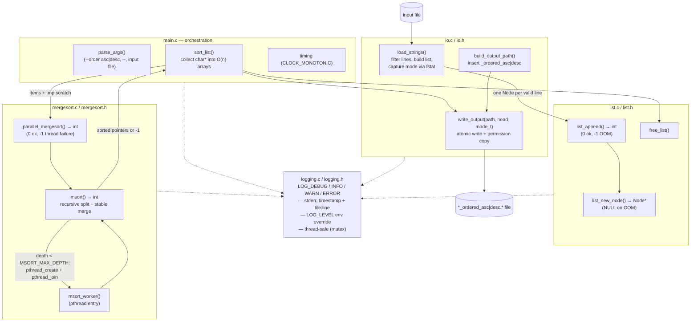

```text
                   ██████╗  █████╗ ██████╗  █████╗ ██╗     ██╗     ███████╗██╗
                   ██╔══██╗██╔══██╗██╔══██╗██╔══██╗██║     ██║     ██╔════╝██║
                   ██████╔╝███████║██████╔╝███████║██║     ██║     █████╗  ██║
                   ██╔═══╝ ██╔══██║██╔══██╗██╔══██║██║     ██║     ██╔══╝  ██║
                   ██║     ██║  ██║██║  ██║██║  ██║███████╗███████╗███████╗███████╗
                   ╚═╝     ╚═╝  ╚═╝╚═╝  ╚═╝╚═╝  ╚═╝╚══════╝╚══════╝╚══════╝╚══════╝
███╗   ███╗███████╗██████╗  ██████╗ ███████╗    ███████╗ ██████╗ ██████╗ ████████╗███████╗██████╗
████╗ ████║██╔════╝██╔══██╗██╔════╝ ██╔════╝    ██╔════╝██╔═══██╗██╔══██╗╚══██╔══╝██╔════╝██╔══██╗
██╔████╔██║█████╗  ██████╔╝██║  ███╗█████╗      ███████╗██║   ██║██████╔╝   ██║   █████╗  ██████╔╝
██║╚██╔╝██║██╔══╝  ██╔══██╗██║   ██║██╔══╝      ╚════██║██║   ██║██╔══██╗   ██║   ██╔══╝  ██╔══██╗
██║ ╚═╝ ██║███████╗██║  ██║╚██████╔╝███████╗    ███████║╚██████╔╝██║  ██║   ██║   ███████╗██║  ██║
╚═╝     ╚═╝╚══════╝╚═╝  ╚═╝ ╚═════╝ ╚══════╝    ╚══════╝ ╚═════╝ ╚═╝  ╚═╝   ╚═╝   ╚══════╝╚═╝  ╚═╝
            ███████╗ ██████╗ ██████╗     ███╗   ███╗ █████╗  ██████╗ ██████╗ ███████╗
            ██╔════╝██╔═══██╗██╔══██╗    ████╗ ████║██╔══██╗██╔════╝██╔═══██╗██╔════╝
            █████╗  ██║   ██║██████╔╝    ██╔████╔██║███████║██║     ██║   ██║███████╗
            ██╔══╝  ██║   ██║██╔══██╗    ██║╚██╔╝██║██╔══██║██║     ██║   ██║╚════██║
            ██║     ╚██████╔╝██║  ██║    ██║ ╚═╝ ██║██║  ██║╚██████╗╚██████╔╝███████║
            ╚═╝      ╚═════╝ ╚═╝  ╚═╝    ╚═╝     ╚═╝╚═╝  ╚═╝ ╚═════╝ ╚═════╝ ╚══════╝
```

> **Target platform: macOS only** — Apple silicon and Intel Macs.
> The build system (`cc`/`clang` from Xcode Command Line Tools), the test scripts (`zsh`), and the memory-leak verification (`leaks`, `codesign`) rely on macOS-specific tooling. Linux and Windows are **not** supported.

---

## What It Is

Parallel Merge Sorter is a C program that:

1. **Reads** the lines of an input file into a heap-allocated singly linked list (each node owns a copy of its string).
2. **Sorts** the strings lexicographically (ascending or descending) with a multi-threaded merge sort (POSIX threads).
3. **Writes** the sorted lines to a *new* file next to the input — the input name with `_ordered_asc` or `_ordered_desc` inserted right before the last extension.

| Input | Output (ascending) |
|---|---|
| `data.txt` | `data_ordered_asc.txt` |
| `data.tar.gz` | `data.tar_ordered_asc.gz` |
| `data` | `data_ordered_asc` |
| `.secret` | `.secret_ordered_asc` *(dotfile: no real extension)* |

The input file is **never modified**. Sorting only rearranges the `char*` pointers; the pointed-to strings are never changed, and the linked structure itself is left untouched.

### Key Parameters

| Constant | Value | Location | Purpose |
|---|---|---|---|
| `MAX_LENGTH` | 256 | `main.c` | Max accepted length of a data line |
| `BUF_SIZE` | 4096 | `io.c` | Line read buffer (must be > `MAX_LENGTH`) |
| `MSORT_BASE_CASE` | 1024 | `mergesort.c` | Ranges ≤ this use insertion sort |
| `MSORT_MAX_DEPTH` | 4 | `mergesort.c` | Max parallel fork levels (≤ 16 threads) |

### How the Parallel Merge Sort Works (`mergesort.c`)

- Ranges larger than `MSORT_BASE_CASE` are split in half: the **left half** is sorted by a child pthread (per-thread job struct, then `pthread_join`), the **right half** by the calling thread.
- Fork depth is capped at `MSORT_MAX_DEPTH`, bounding the thread count to at most **16**.
- Sorted halves are merged into a caller-supplied *O(n)* scratch buffer and copied back (stable merge).
- If `malloc` or `pthread_create` ever fails, the algorithm degrades gracefully to a **fully sequential sort** of both halves (`DEBUG` log).
- If `pthread_join` fails, the sort is **aborted** and `-1` is returned (the worker thread's lifetime is indeterminate, so re-entering shared memory would be a data race).
- `parallel_mergesort()` returns `0` on success, `-1` on thread failure.
- **No global state**: everything travels through parameters or per-thread job structs — the code is thread-safe.

> **Time:** *O(n log n)* &nbsp;&nbsp; **Space:** *O(n)*

### Line-Reading Policy (`io.c`, `load_strings`)

- A trailing `\r\n` or `\n` is stripped (CRLF input is fine).
- Embedded CR (not at end of line) is **preserved** as data.
- Empty lines are skipped (`DEBUG` log).
- Lines containing **embedded NUL bytes** are rejected with a `WARN` log (including NUL bytes at EOF without a trailing newline).
- Lines longer than `MAX_LENGTH` (256) are skipped with a `WARN` log.
- A line that does not fit in the 4096-byte read buffer is consumed in full (its tail is never re-parsed as new lines) and skipped with a `WARN` log.
- Ordering is pure byte/`strcmp` order, so `"10" < "2"` (lexicographic, not numeric).
- Input file permissions are captured via `fstat` on the open descriptor (**no TOCTOU window** between close and stat).

### List Allocation (`list.c`)

- `list_new_node()` returns `NULL` on `malloc` failure (does **not** call `exit`); the caller (`load_strings`) detects this and returns `-1`.
- `list_append()` returns `0` on success, `-1` on allocation failure.

### Output Writing (`io.c`, `write_output`)

- Writes to a temporary file (`mkstemp`) then **atomically renames** it into place; symlinks at the destination are not followed.
- The output file's permissions are set to match the input file's (passed as a `mode_t` parameter captured earlier via `fstat`).
- `fflush` and `fclose` are called **independently** (no short-circuit): `fclose` always runs even if `fflush` fails, preventing fd leaks.
- Every `write`, `fflush`, `fclose`, and `rename` is checked; on any error the temp file is unlinked and `EXIT_FAILURE` is returned.

### Features

- **Leveled logging** (`DEBUG` < `INFO` < `WARN` < `ERROR`) on stderr, with `YYYY-MM-DD HH:MM:SS [LEVEL] file:line message` format. Runtime override via the `LOG_LEVEL` environment variable. Thread-safe (mutex-serialized records).
- **Non-interactive**: sort direction is a CLI option, never a prompt.
- **`--` end-of-options marker**: arguments after `--` are treated as positional (allows input files starting with a dash).
- If the input yields **no valid lines**, a `WARN` is emitted, an **empty output file** is written (replacing any stale previous output), and the program exits `0`.
- The program measures its own **wall-clock elapsed time** (`CLOCK_MONOTONIC`, nanosecond precision) and emits it as a final `INFO` log line: `Elapsed time: <s>.<ns> s`.
- Internal counters (line count, item count, output count) use `size_t` to avoid signed integer overflow on very large inputs.

---

## Repository Layout

```
.
├── main.c                CLI parsing, orchestration, timing
├── io.c / io.h           input parsing, output path building, writing
├── list.c / list.h       singly linked list of owned strings
├── mergesort.c / .h      multi-threaded merge sort (pthread)
├── logging.c / .h        leveled logging facility
├── Makefile              build + test targets (cc, -pthread)
├── sorter                (compiled binary, produced by make)
└── tests/
    ├── generate_fixtures.zsh   generates all fixture cases
    ├── run_tests.zsh           automated correctness suite
    ├── run_perf_test.zsh       large-file performance test
    ├── check_leaks.zsh         memory leak check (macOS only)
    ├── data/random-words.txt   2643-word performance input
    ├── fixtures/               (generated) per-case inputs,
    │                           expected outputs and .meta files
    ├── exploration/            fault-injection tests (bug fixes)
    │   ├── Makefile
    │   ├── test_1a_pthread_create_fail.c
    │   ├── test_1b_pthread_join_fail.c
    │   ├── test_1d_fflush_fclose.c
    │   └── test_1e_oom_list.c
    └── preservation/           fault-injection tests (regressions)
        ├── Makefile
        └── test_2e_sequential_fallback.c
```

---

## Architecture



---

## Testing Facilities

```mermaid
flowchart TD
    MT["make test"] --> B["make build<br/>cc -Wall -Wextra -O2<br/>main.c logging.c list.c io.c mergesort.c -pthread"]
    MT --> T1

    subgraph T1["1 · Correctness suite — run_tests.zsh"]
        F["generate_fixtures.zsh<br/>29 fixture cases, each with:<br/>input + expected output + .meta"]
        SB["per-case isolated sandbox"]
        CK["checks per case:<br/>— exit code (0 or 1)<br/>— output file name<br/>— byte-exact content diff<br/>— WARN log expectation"]
        F --> SB --> CK
    end

    MT --> T2

    subgraph T2["2 · Fault-injection tests"]
        EX["exploration (4 tests):<br/>1a pthread_create failure<br/>1b pthread_join failure<br/>1d fflush/fclose short-circuit<br/>1e OOM in list_new_node"]
        PR["preservation (1 test):<br/>2e MSortJob OOM sequential fallback"]
        EX --> PR
    end

    MT --> T3

    subgraph T3["3 · Performance — run_perf_test.zsh"]
        PI["data/random-words.txt (2643 lines)"]
        R1["asc + desc runs:<br/>exit code · file name · diff · no WARN"]
        RC["elapsed-time recap"]
        PI --> R1 --> RC
    end

    MT --> T4

    subgraph T4["4 · Sanitizers & leaks — check_leaks.zsh"]
        AS["ASan + UBSan · TSan"]
        LK["macOS leaks<br/>(codesign + MallocStackLogging)"]
        AS --> LK
    end
```



### Fixture Cases (29)

**Positive paths:** basic asc, basic desc, default order (omitted), single element, duplicates, extension-less input, multi-dot extension (`data.tar.gz`), CRLF endings, embedded CR mid-line, special characters (spaces, quotes, tabs), numeric strings (lexicographic order), 50 seeded random strings, hidden file (dotfile), `--` end-of-options marker, boundary-length records (255, 256 bytes), final record without trailing LF.

**Negative paths:** 300-char overlong line (`WARN` + skip), 5000-char line (over the read buffer), empty lines, empty file (empty output written), embedded NUL mid-line, embedded NUL at EOF, unknown CLI option, missing `--order` value, multiple input files, invalid `--order` value, missing input file.

Five **integration tests** run after the fixtures: dotted parent directory, symlink at output path, permission preservation, stale output replacement, and `./` relative dotfile path.

### Fault-Injection Tests

These compile production `.c` files directly with `#define` macro wrappers to intercept system calls (`pthread_create`, `pthread_join`, `fflush`, `fclose`, `malloc`). They exercise error-handling code paths that **cannot be triggered** by normal inputs:

| Test | Injected failure | Expected behaviour |
|---|---|---|
| `test_1a` | `pthread_create` → `EAGAIN` | Both halves sorted inline |
| `test_1b` | `pthread_join` → `ESRCH` | Returns `-1`, no data race |
| `test_1d` | `fflush` → `EOF` | `fclose` still called (no fd leak) |
| `test_1e` | `malloc` → `NULL` in `list_new_node` | Returns `NULL` (no `exit`) |
| `test_2e` | `malloc` → `NULL` for `MSortJob`-sized allocs | Correct sequential output |

Built with `-O0` to prevent optimisations that might interfere with macro interposition.

---

## Step-by-Step Instructions

### Prerequisites (macOS)

1. **Xcode Command Line Tools** installed:
   ```bash
   xcode-select --install
   ```
   *(provides `cc`/`clang`, `make`, `leaks`, `codesign`)*

2. **`zsh`** in `PATH` (ships with macOS; used by the test scripts).

---

### 1. Compile

**Option A** — Makefile (recommended):

```bash
make            # or: make build
```

This runs:

```bash
cc -Wall -Wextra -O2 -o sorter \
    main.c logging.c list.c io.c mergesort.c -pthread
```

and prints `Build OK: sorter`.

> **Note:** `-pthread` is required at link time; the Makefile adds it automatically (`LDLIBS := -pthread`).

**Option B** — use `gcc` explicitly (e.g. Homebrew):

```bash
make CC=gcc
# or manually:
gcc -Wall -Wextra -O2 -o sorter \
    main.c logging.c list.c io.c mergesort.c -pthread
```

**Smoke test** — running with no arguments prints the usage line on stderr and exits `1`:

```bash
./sorter
# → Usage: ./sorter [--order asc|desc] [--] <input_file>
```

---

### 2. Run

```bash
./sorter [--order asc|desc] [--] <input_file>
```

| Argument | Description |
|---|---|
| `<input_file>` | Required. Exactly one positional argument. |
| `--order asc` | Sort ascending *(default — can be omitted)*. |
| `--order desc` | Sort descending. |
| `--` | End of options — the next argument is the input file, even if it starts with `-`. |

**Error handling:** unknown options, a missing value after `--order`, an invalid `--order` value, or more than one input file are fatal: `ERROR` log + usage line on stderr, exit code `1`.

**Examples:**

```bash
./sorter notes.txt                  # ascending (default)
./sorter --order asc notes.txt      # ascending, explicit
./sorter --order desc notes.txt     # descending
./sorter -- -tricky-name.txt        # file starting with -
```

**Read the result** — the sorted copy is written next to the input file; the input itself is untouched:

```bash
./sorter --order desc data.txt
cat data_ordered_desc.txt
```

**Interpret the logs** (all on stderr, default level `INFO`):

```
2026-08-26 12:39:53 [INFO ] main.c:182 === Linked-List String Sorter (File I/O) ===
2026-08-26 12:39:53 [INFO ] io.c:81    Reading strings from "data.txt".
2026-08-26 12:39:53 [INFO ] io.c:123   Loaded 3 string(s) from "data.txt".
2026-08-26 12:39:53 [INFO ] main.c:201 Sorted list (ascending):
2026-08-26 12:39:53 [INFO ] io.c:155   Wrote 3 string(s) to "data_ordered_asc.txt".
2026-08-26 12:39:53 [INFO ] main.c:215 Elapsed time: 0.000137000 s
```

**Exit codes:** `0` = success (including "nothing to sort" — an empty output file is written in that case), `1` = failure (bad arguments, unreadable input, write error, thread failure).

---

### 3. Debug

**Turn on verbose logging** (cheapest first step):

```bash
LOG_LEVEL=DEBUG ./sorter notes.txt
```

Levels, lowest to highest severity: `DEBUG`, `INFO`, `WARN`, `ERROR` (default: `INFO`). Each line carries the timestamp, level, and the `file:line` of the call site:

```
2026-08-26 12:41:02 [DEBUG] io.c:105 Line 2 is empty; skipped.
```

> The merge sort also emits `DEBUG` lines when it degrades to sequential sorting (OOM or `pthread_create` failure), which helps diagnose thread-creation problems.

**Rebuild with debug symbols and no optimisation:**

```bash
cc -Wall -Wextra -O0 -g -o sorter_dbg \
    main.c logging.c list.c io.c mergesort.c -pthread
```

**Run under `lldb`** (ships with the Command Line Tools):

```bash
lldb ./sorter_dbg
(lldb) b main
(lldb) r --order desc notes.txt
(lldb) n                # step over
(lldb) s                # step into
(lldb) p ascending
(lldb) bt               # backtrace
(lldb) thread list      # inspect the sort worker threads
(lldb) b msort          # break inside the parallel sort
(lldb) c                # continue
```

Non-interactive one-shot backtrace on crash:

```bash
lldb -b -o run -o bt ./sorter_dbg -- --order desc notes.txt
```

**Heap debugging** environment variables (very useful on macOS, which has no Valgrind):

```bash
MallocStackLogging=1 MallocScribble=1 ./sorter_dbg notes.txt
```

- `MallocStackLogging` — allocation/stack backtraces in crashes and in leaks reports.
- `MallocScribble` — poisons freed memory so use-after-free bugs fail loudly.

**Keep test sandboxes** for post-mortem inspection:

```bash
zsh tests/run_tests.zsh -k
ls tests/_sandbox/       # per-case input, output and run.log
```

---

### 4. Run the Automated Tests

**The one-command way:**

```bash
make test
```

This runs, in order — exiting non-zero as soon as any phase fails:

| Phase | Command | What it does |
|---|---|---|
| **a.** | `make build` | Compile the sorter |
| **b.** | `zsh tests/run_tests.zsh` | Correctness suite (29 fixture cases + 5 integration tests) |
| **c.** | `make -C tests/exploration run` | Fault-injection tests (4 exploration tests) |
| | `make -C tests/preservation run` | Fault-injection tests (1 preservation test) |
| **d.** | `zsh tests/run_perf_test.zsh` | Performance test (2643-line file, asc + desc) |
| **e.** | `zsh tests/check_leaks.zsh` | ASan, UBSan, TSan, macOS `leaks` |

#### Correctness suite (`tests/run_tests.zsh`)

For every fixture case under `tests/fixtures/<case>/` it:

1. Copies the input into an isolated sandbox (`tests/_sandbox/<case>/`).
2. Runs the sorter inside the sandbox.
3. Verifies the **exit code** (0 or non-zero per `.meta`).
4. Verifies the generated **output file name** (extension handling, dotfiles, extension-less files, or `NONE` for error cases).
5. Compares the output **byte-for-byte** against the expected file (`diff`).
6. Verifies whether a `WARN` log was (not) expected.

#### Performance test (`tests/run_perf_test.zsh`)

- Sorts `tests/data/random-words.txt` (2643 real words) in an isolated sandbox, in both directions (asc and desc).
- Builds the expected output independently with plain text tools (`awk` implementing the sorter's filter rules piped to `LC_ALL=C sort`) and compares byte-for-byte.
- Checks the exit code, the output file name, and the absence of `WARN` logs for each run.
- Prints a recap with the elapsed time (parsed from the sorter's own `Elapsed time:` log line).
- On failure the sandbox is kept at `tests/_perf_sandbox`.
- To stress with a bigger file: `PERF_INPUT=/path/to/bigger/file zsh tests/run_perf_test.zsh`

#### Memory leak verification (`tests/check_leaks.zsh`) — *macOS only*

1. Refuses to run on any OS other than macOS (Darwin).
2. Builds disposable binaries in an isolated sandbox:
   - One with `-fsanitize=address,undefined` for **ASan + UBSan**.
   - One with `-fsanitize=thread` for **TSan**.
   - One with `-O0 -g` for the Apple **`leaks`** tool.
3. Runs the ASan/UBSan binary against the correctness suite and the threaded performance test.
4. Runs the TSan binary against the threaded performance test.
5. Ad-hoc re-signs the leaks binary with `codesign` using the `com.apple.security.get-task-allow` entitlement, then runs:
   ```bash
   leaks -quiet -groupByType -conservative -atExit -- \
       ./sort_test_leaks --order asc basic.txt
   ```
   with `MallocStackLogging=1` and `MallocScribble=1`.
6. Removes all temporary artifacts on exit.

**Result:** exit code `0` = all sanitizers and leaks clean; non-zero = a diagnostic or leak was found (relevant output is printed).

#### Run individual pieces on demand

```bash
make fixtures                        # (re)generate fixtures only
zsh tests/run_tests.zsh              # correctness suite
zsh tests/run_tests.zsh -k           # … and keep sandboxes
make -C tests/exploration run        # fault-injection (exploration)
make -C tests/preservation run       # fault-injection (preservation)
zsh tests/run_perf_test.zsh          # performance test
zsh tests/check_leaks.zsh            # sanitizers + leak check
make clean                           # remove binary + all test artifacts
```

> All scripts are self-sufficient: if `./sorter` is missing they build it (same flags as the Makefile), and `run_tests.zsh` generates the fixtures if they are missing.
